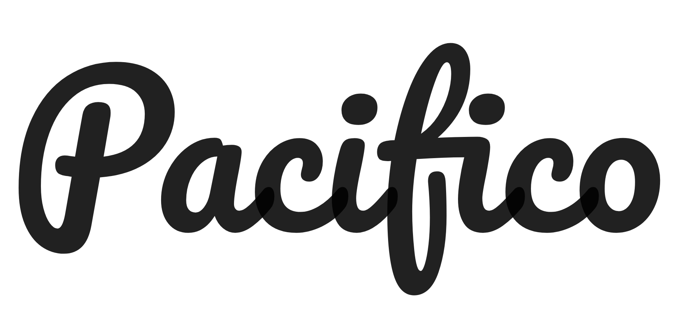

# Pacifico

## About Pacifico Project

Aloha! Pacifico is an original and fun brush script handwriting font by Vernon Adams which was inspired by the 1950s American surf culture in 2011. It was redrawn by Jacques Le Bailly at Baron von Fonthausen in 2016. It was expanded to Cyrillic by Botjo Nikoltchev and Ani Petrova at Lettersoup in 2017.

The Pacifico project was commissioned by Google from Vernon Adams, an English type designer who lived in San Clemente, Los Angeles, USA. To contribute, see github.com/googlefonts/Pacifico

Updated June 2019 to v3.000: Added extended Cyrillic support.

## Build

Build the fonts with `gftools builder sources/config.yaml` from the repository’s root folder

## Test

Test the fonts with `fontbakery check-googlefonts fonts/variable/*.ttf` and `fontbakery check-googlefonts fonts/ttf/*.ttf` from the repository’s root folder

## FONTLOG for Pacifico

### December 2023 (Raphael Alegbeleye, Eben Sorkin) v3.010

- Expand glyphset to Africa Pri

## Authors
- Vernon Adams

## Contributors
- Jacques Le Bailly
- Botjo Nikoltchev
- Ani Petrova
- Raphael Alegbeleye

## License
This Font Software is licensed under the SIL Open Font License, Version 1.1.
This license is copied below, and is also available with a FAQ at:
https://scripts.sil.org/OFL
